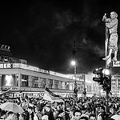

##Instructions for finding a photograph for your map

* Find a photograph of Berlin in [Flickr](https://www.flickr.com) or any other source with [EXIF](https://en.wikipedia.org/wiki/Exchangeable_image_file_format) data and a [Creative Commons](http://creativecommons.org/) license. For example, [Fan Party](https://www.flickr.com/photos/ffela/14500796957) by Hans-Jörg Aleff.

* Download a copy of the photograph in [Square format](https://farm4.staticflickr.com/3840/14500796957_8b7486f127_q_d.jpg) and save in the /images folder of your local copy of EUS0991.01.

* Get the EXIF data from the photograph by clicking on "Show EXIF". Please note that the EXIF data is in degrees, minutes, seconds format.

* Convert the EXIF data into decimal format using an [online converter](http://www.fcc.gov/encyclopedia/degrees-minutes-seconds-tofrom-decimal-degrees). Note that you'll need to remove the character codes for the minutes (```&#x27;```) and seconds (```&quot;```)

* Plug your decimal coodinates into [Google Maps](https://www.google.com/maps/place/52%C2%B030'13.0%22N+13%C2%B019'53.4%22E/@52.5036106,13.3315,15z/data=!3m1!4b1!4m2!3m1!1s0x0:0x0), remembering to separate them with a comma.

* Open ```map.geojson``` in the \scripts folder of your local copy of EUS0991.01 in the [Atom](https://atom.io/) editor.

* Copy a "feature" from the existing GeoJson. For example,
    ```json
    {
    "type": "Feature",
    "properties": {
      "title": "Brandenburg Gate",
      "marker-size": "medium",
      "marker-color": "#3366FF",
      "marker-symbol": "star-stroked",
      "images": [
        ['',
          "The Brandenburg Gate."
        ],
        ['',
          "The Brandengurb Gate quadriga at night."
        ]
      ]
    },
    "geometry": {
      "type": "Point",
      "coordinates": [
        "13.377674",
        "52.516224"
      ]
    }
  }
  ```
* Edit the GeoJSON to reflect the information about your new point and image. Be sure to include official title and authorial credit in the description of the image. For example,

 ```json
    {
    "type": "Feature",
    "properties": {
      "title": "Kurfürstendamm",
      "marker-size": "medium",
      "marker-color": "#3366FF",
      "marker-symbol": "star-stroked",
      "images": [
        ['',
          "Fan Party by Hans-Jörg Aleff."
        ]
      ]
    },
    "geometry": {
      "type": "Point",
      "coordinates": [
        "13.327080",
        "52.503101"
      ]
    }
  }
```
* Finally, add your new GeoJSON point to the existing GeoJSON feature collection. For example,

    ```JSON
    var geoJson = [{
  "type": "FeatureCollection",
  "features": [{
    "type": "Feature",
    "properties": {
      "title": "Brandenburg Gate",
      "marker-size": "medium",
      "marker-color": "#3366FF",
      "marker-symbol": "star-stroked",
      "images": [
        [
          "",
          "The Brandenburg Gate."
        ],
        [
          "",
          "The Brandengurb Gate quadriga at night."
        ]
      ]
    },
    "geometry": {
      "type": "Point",
      "coordinates": [
        "13.377674",
        "52.516224"
      ]
    }
  }, {
    "type": "Feature",
    "properties": {
      "title": "Koeningsplatz",
      "marker-size": "medium",
      "marker-color": "#e5c278",
      "marker-symbol": "star-stroked",
      "images": [
        [
          "<iframe width=\"180\"  src=\"http://www.youtube.com/embed/cklBBshc_uQ?rel=0\" frameborder=\"0\" allowfullscreen><\/iframe>",
          "A tour of the Reichstag building."
        ],
        [
          "",
          "The Reichstag building."
        ]
      ]
    },
    "geometry": {
      "type": "Point",
      "coordinates": [
        "13.376199",
        "52.517539"
      ]
    }
  }, {
    "type": "Feature",
    "properties": {
      "title": "Kurfürstendamm",
      "marker-size": "medium",
      "marker-color": "#3366FF",
      "marker-symbol": "star-stroked",
      "images": [
        [
          "",
          "Fan Party by Hans-Jörg Aleff."
        ]
      ]
    },
    "geometry": {
      "type": "Point",
      "coordinates": [
        "13.327080",
        "52.503101"
      ]
    }
  }]
}];
```
* After saving everything, you should be finished! To check your work, double-click on "index.html" and your new point should now appear on your map.


