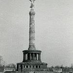
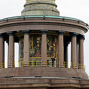

##Instructions for finding a youtube video for your map

* Find a video of Berlin in [youTube](https://www.youtube.com/) or any other source with a [Creative Commons](http://creativecommons.org/) license. For example, [St. Nicholas' Church, Berlin, Germany](https://www.youtube.com/watch?v=uKlPfgi8xHw) by Igor Skoglund.

* Click Share.  CLick Embed.  Copy the embedded url: ```<iframe width="420" height="315" src="https://www.youtube.com/embed/uKlPfgi8xHw" frameborder="0" allowfullscreen></iframe>```

* Edit the link width to 180 and delete the height variable.  You will also want to delete the 's' from 'https:' and add a double quote around your code.  Make sure all of your code matches the following format with slashes as well.  For example : ```"<iframe width='180' src='http://www.youtube.com/embed/uKlPfgi8xHw' frameborder='0' allowfullscreen></iframe>"```

* Find the Latitude and Longitude of the video you want to use with [Google Maps](https://www.google.com/maps/place/St+Nicholas'+Church,+10178+Berlin,+Germany/@52.5168424,13.4074785,17z/data=!3m1!4b1!4m2!3m1!1s0x47a84e20c2c2a4a7:0x73bc4247163b5be8).  Make sure you are using decimal degrees.

* Open ```map.geojson``` in the \scripts folder of your local copy of EUS0991.01 in the [Atom](https://atom.io/) editor.

* Copy a "feature" from the existing GeoJson. For example,
    ```json
    {
    "type": "Feature",
    "properties": {
      "title": "Brandenburg Gate",
      "marker-size": "medium",
      "marker-color": "#3366FF",
      "marker-symbol": "star-stroked",
      "images": [
        ['',
          "The Brandenburg Gate."
        ],
        ['',
          "The Brandengurb Gate quadriga at night."
        ]
      ]
    },
    "geometry": {
      "type": "Point",
      "coordinates": [
        "13.377674",
        "52.516224"
      ]
    }
  }
  ```
* Edit the GeoJSON to reflect the information about your new point and image. Be sure to include official title and authorial credit in the description of the image. For example,

 ```json
   {
  "type": "Feature",
  "properties": {
    "title": "Berlin Victory Column",
    "series": "Spring 2015",
    "tour": "1920",
    "marker-size": "medium",
    "marker-color": "#3366FF",
    "marker-symbol": "star-stroked",
    "images": [
      [
        "",
        "Berlin 1946- Victory Column (Berlin Siegessäule) by mocr. The Victory Column was built to commemorate the Prussian victory in the Danish-Prussian war. In 1920 it stood in Königsplatz, directly across from the Reichstag."
      ],
      [
        "<iframe width='180'  src='http://www.youtube.com/embed/H4wnh2osfGI' frameborder='0' allowfullscreen></iframe>",
        "Siegessäule, Berlin. Each of the three original columns represents a victory over the Danish, a victory over the Austrians, and a victory over the French."
      ],
      [
        "",
        "Untitled by Trevor Warry. In 1938, it was relocated by the Nazis to a larger intersection called the Großer Stern. Today, it is a large tourist attraction. In 1920, it served as a reminder to Germany during World War I of their past victories."
      ]
    ]
  },
  "geometry": {
    "type": "Point",
    "coordinates": [
      "13.3725",
      "52.5186"
    ]
  }
}
```


* After saving everything, you should be ready to add your point to the map database using the Postman directions! 


